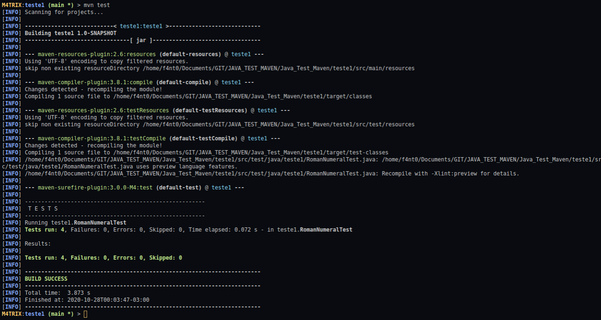

# Primeiro exemplo de Teste Unitário

### Como foi construido

* Utiliza-se o comando `mvn archetype:generate`
* Foi escolhido o formato padrão, no caso desse foi 1688, mas é só clicar enter para **Choose a number**
* Foi selecionado a opção de versão **1.4**
* groupId é **teste1**
* artifactId é **teste1**
* version é **1.0-SNAPSHOT**
* package é **teste1**

### Modificação no pom.xml

* Deve-se colocar essa propriedade dentro da tag **properties**:

**JAVA VERSION**

```xml
<java.version>14</java.version>
```

* Deve-se colocar essas dependencias dentro da tag **dependencies**

**JUnit 5**

```xml
<dependency>
    <groupId>org.junit.jupiter</groupId>
    <artifactId>junit-jupiter-api</artifactId>
    <version>5.6.2</version>
    <scope>test</scope>
</dependency>
<dependency>
    <groupId>org.junit.jupiter</groupId>
    <artifactId>junit-jupiter-engine</artifactId>
    <version>5.6.2</version>
    <scope>test</scope>
</dependency>
```

**HSQLDB**

* Para saber mais: [https://mvnrepository.com/artifact/org.hsqldb/hsqldb](https://mvnrepository.com/artifact/org.hsqldb/hsqldb)

```xml
<dependency>
    <groupId>org.hsqldb</groupId>
    <artifactId>hsqldb</artifactId>
    <version>2.5.0</version>
</dependency>
```

* Deve-se colocar esses plugins dentro da tag **pluginManagement**:

```xml
<plugin>
    <groupId>org.apache.maven.plugins</groupId>
    <artifactId>maven-compiler-plugin</artifactId>
    <version>3.8.1</version>
    <configuration>
        <source>14</source>
        <target>14</target>
        <compilerArgs>
            <arg>--enable-preview</arg>
        </compilerArgs>
    </configuration>
</plugin>
<plugin>
    <groupId>org.apache.maven.plugins</groupId>
    <artifactId>maven-surefire-plugin</artifactId>
    <version>3.0.0-M4</version>
    <configuration>
        <argLine>--enable-preview</argLine>
    </configuration>
</plugin>
```

**REINSTALANDO**

* Após terminar de alterar o POM.xml, use o seguinte comando no terminal: `mvn clean install`
* **OBS**: faça isso sem fazer modificações nos arquivos de código e teste

### Classe Alvo

Foi desenvolvido um programa simples de conversão de Números romanos para Decimais,onde:

* Criado valores possíveis em um HashMap, como abaixo:

```java
private static Map<Character,Integer> map;
static {
    map = new HashMap<Character,Integer>();
    map.put('I',1);
    map.put('V',5);
    map.put('X',10);
    map.put('L',50);
    map.put('C',100);
    map.put('D',500);
}
```

* Desenvolvido um Método de conversão

```java
public int convert(String s){
    int convertedNumber = 0;
    for(int i = 0 ; i < s.length() ; i++){
        int currentNumber = map.get(s.charAt(i));
        int next = i+1 < s.length() ? map.get(s.charAt(i+1)) : 0;
            
        if(currentNumber >= next){
            convertedNumber += currentNumber;
        }else{
            convertedNumber -= currentNumber;
        }
    }
    return convertedNumber;
}
```

### Casos de Teste

Valores de Entrada|Resultado esperado
|---|---|
I|1
VII|7
IV|4
XLIV|44

### Driver de Teste

* Agora que temos a Classe alvo definida e os testes que queremos fazer, vamos criar a classe Driver.

**RomanNumeralTest.java**

* IMPORTS:

```java
// Para adicionar Asserções no Projeto
import org.junit.jupiter.api.Assertions;

// Para usar a anotação BeforeEach
import org.junit.jupiter.api.BeforeEach;

// Para usar a anotação Test
import org.junit.jupiter.api.Test;
```

* Criando o Método incializador **BeforeEach**:

```java
// Iniciamos um objeto privado da Classe RomanNumeral
private RomanNumeral roman;

//Inicializamos o Objeto
@BeforeEach
public void initialize(){
    this.roman = new RomanNumeral();
}
```

* Testando somente um número(primeiro caso de Teste):
* Assertions.assertEquals(valEsperado,valRecebido)

```java
@Test
public void singleNumber(){
    int result = roman.convert("I");
    Assertions.assertEquals(1,result);
}
```

* Testando vários números juntos(segundo caso de Teste):

```java
@Test
public void numberWithManyDigits(){
    int result = roman.convert("VII");
    Assertions.assertEquals(7,result);
}
```

* Testando numero menor antes do numero maior(terceiro caso de Teste):

```java
@Test
public void numberWithSubtractiveNotation(){
    int result = roman.convert("IV");
    Assertions.assertEquals(4,result);
}
```

* Testando com várias opções(quarto caso de Teste):

```java
@Test
public void numberWithAndWithoutSubnotation(){
    int result = roman.convert("XLIV");
    Assertions.assertEquals(44,result);
}
```

### Resultado do Teste

* Utilize o comando `mvn test` para iniciar o processo de teste
* Resultado esperado:



